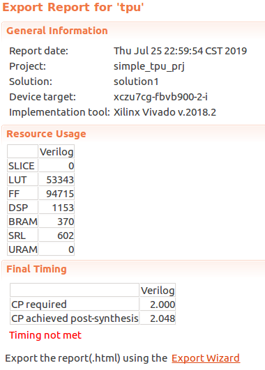
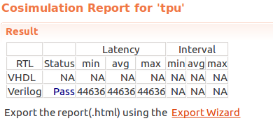
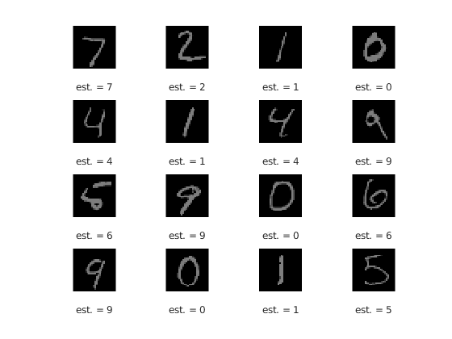

# SimpleTPU

A Tensor Processing Unit is designed to accelerate the matrix multiplication, especially for Multilayer perceptron and Convolution Nerual Network.    
This implmentaion is mainly following the Google TPU Version 1, which architecture is introduced in [https://arxiv.org/ftp/arxiv/papers/1704/1704.04760.pdf](https://arxiv.org/ftp/arxiv/papers/1704/1704.04760.pdf "In-Datacenter Performance Analysis of a Tensor Processing Unit").

It may cost a lot of time to implementation TPU using Hardware Description Language (such as VHDL or Verilog HDL), even if I had tried to simplify it. So I try to use the Xilinx HLS ToolKit to complete it. 

The plan is divided into three phases.

- Phase 1: Completing the main computing module,including
    - Lab1:Systolic Array
    - Lab2:Relu, Normalization & Pooling 
- Phase 2: Finish the full design of simpleTPU.
- Phase 3: Testing the simpleTPU through some real network, such as MLP and CNN.

# Key Features

The key features of Simple TPU including
- Int8 mulitply & Int32 accumulators
- VLIW based instruction parallel
- Vector Architecture based data parallel

Here are some operate which Simple TPU can support. 

Operate | Support
-|-
Conv3d | in_channels: Resource Constrained  <br> out_channels: Resource Constrained<br>kerner_size: Support<br>stride: support<br>padding: Support<br>dilation:Support<br>groups: Architecture Constrained<br>bias    :Support
ConvTranspose3d | The same as above
Maxpool2d | kernel_size: Support <br>stride: Support<br>padding: Support    
Avgpool2d | The same as above
Relu | Only support Relu as nonlinear function
BatchNorm2d | BatchNorm2d is merge with Conv or Pool when inference
Linear | Resource Constrained 
UpscalingNearest2D | Support (calling Avgpool2d multiple times.)
UpscalingBilinear2D | Support (calling Avgpool2d multiple times.)


# Performance
The size of mac array in SimpleTPU is 32*32, the clock frequency is 500MHz (timing closure when using Xilinx ultrascale+ FPGA, Speed -2).  
$$32\times 32 \times 500 \times 2 = 1 Tops(int8)$$

# Installation
 **env** :   
 - Vivado HLS 2018.2

 **run** :  
 - step1: `vivado_hls -f run_hls.tcl`
 - step2: lanch vivado HLS and open the project  
 - step3: Run C synthesis, C/RTL cosimulation e.t.c

**Synthesis Result**:    
    
**Simulation Result**:    

# Examlpes
## 1. MLP
The network structure of mlp is defined as follow.
```
class MLP(nn.Module):
    def __init__(self):
        super(MLP, self).__init__()
        self.hidden = nn.Linear(784,64)
        self.fc = nn.Linear(64,10)

    def forward(self, x):
        x = x.view(-1,784)
        x = self.hidden(x)
        x = self.fc(x)
        return F.log_softmax(x, dim=1)
```

Work efficiency of SimpleTPU is about 84%.


|LOC| Layers | Nonlinear function | Weights | Batch Size | % of Deployed|
|---|---|---|----|----|----|
|10 | 2 FC | Relu | 5M | 512 | 16%|

Classfication Result in MNIST.


## 2. CNN
Because there is no compiler to generate instruction, this plan was suspended.
If you want to kown how to calculate convolution using SimpleTPU, lab1  provides a simple example.


# Relative Link  
https://www.cnblogs.com/sea-wind/p/10993958.html
